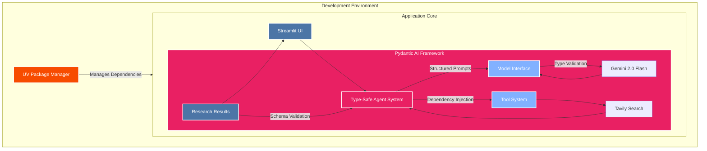

```mermaid
flowchart TB
    subgraph Development["Development Environment"]
        UV[UV Package Manager] --> |Manages Dependencies| App
    end
    
    subgraph App["Application Core"]
        UI[Streamlit UI] --> Agent
        
        subgraph PydanticAI["Pydantic AI Framework"]
            Agent[Type-Safe Agent System] --> |Structured Prompts| ModelInterface
            ModelInterface[Model Interface] --> |Type Validation| Gemini[Gemini 2.0 Flash]
            Agent --> |Dependency Injection| Tools
            Tools[Tool System] --> Search[Tavily Search]
            
            Results[Research Results] --> |Schema Validation| Agent
        end
        
        Search --> Agent
        Gemini --> ModelInterface
        Results --> UI
    end

    classDef primary fill:#4c75a6,stroke:#fff,stroke-width:2px,color:#fff
    classDef secondary fill:#82b1ff,stroke:#fff,stroke-width:2px,color:#fff
    classDef rust fill:#F74C00,stroke:#fff,stroke-width:2px,color:#fff
    classDef pydantic fill:#E92063,stroke:#fff,stroke-width:2px,color:#fff
    
    class UI,Results primary
    class ModelInterface,Tools secondary
    class UV rust
    class Agent,PydanticAI pydantic
```