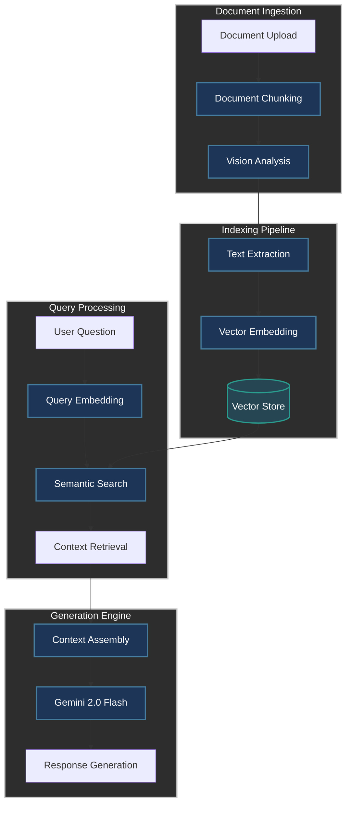

```mermaid
graph TB
    subgraph Input ["Document Ingestion"]
        A[Document Upload] --> B[Document Chunking]
        B --> C[Vision Analysis]
    end

    subgraph Index ["Indexing Pipeline"]
        C --> D[Text Extraction]
        D --> E[Vector Embedding]
        E --> F[(Vector Store)]
    end

    subgraph Query ["Query Processing"]
        G[User Question] --> H[Query Embedding]
        H --> I[Semantic Search]
        F --> I
        I --> J[Context Retrieval]
    end

    subgraph Generate ["Generation Engine"]
        J --> K[Context Assembly]
        K --> L[Gemini 2.0 Flash]
        L --> M[Response Generation]
    end

    classDef pipeline fill:#2d2d2d,stroke:#c9c9c9,stroke-width:2px,color:#ffffff
    classDef storage fill:#264653,stroke:#2a9d8f,stroke-width:2px,color:#ffffff
    classDef process fill:#1d3557,stroke:#457b9d,stroke-width:2px,color:#ffffff
    
    class Input,Index,Query,Generate pipeline
    class F storage
    class B,C,D,E,H,I,K,L process
```